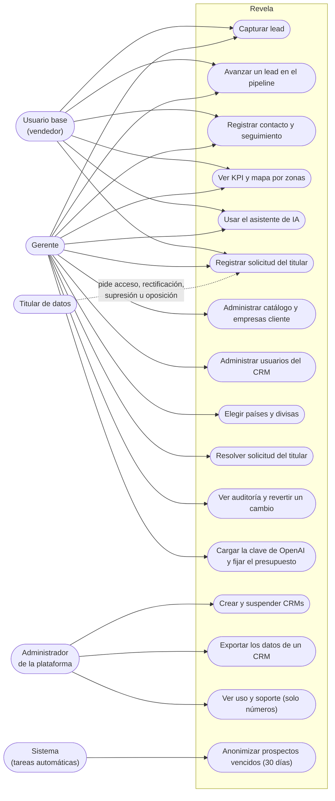
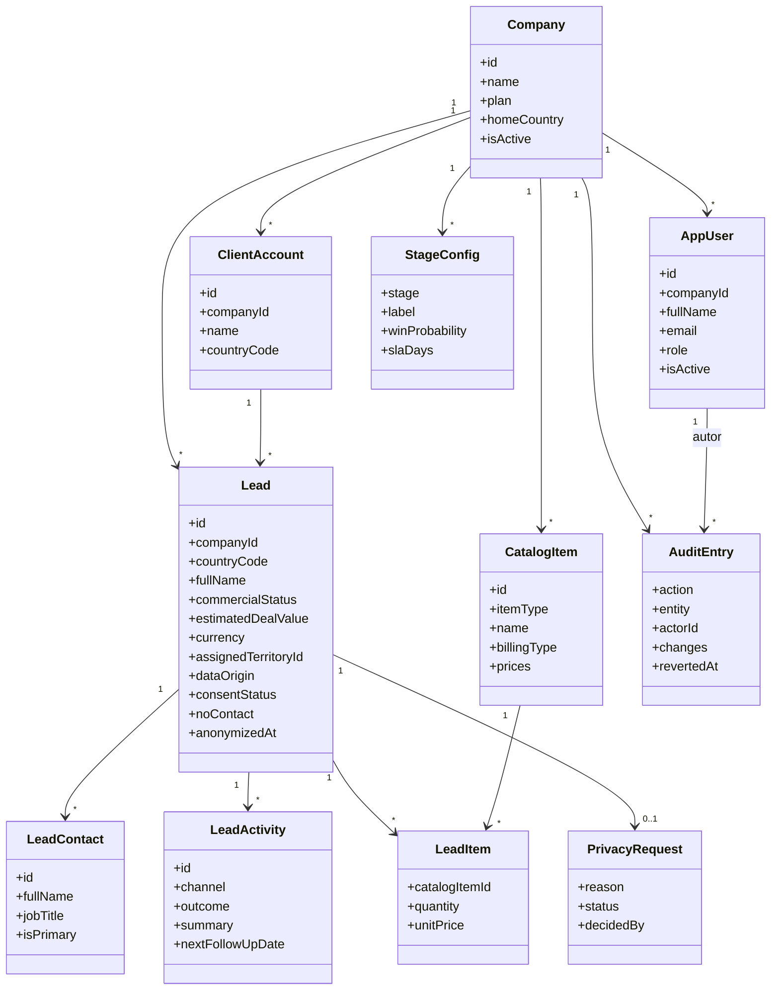
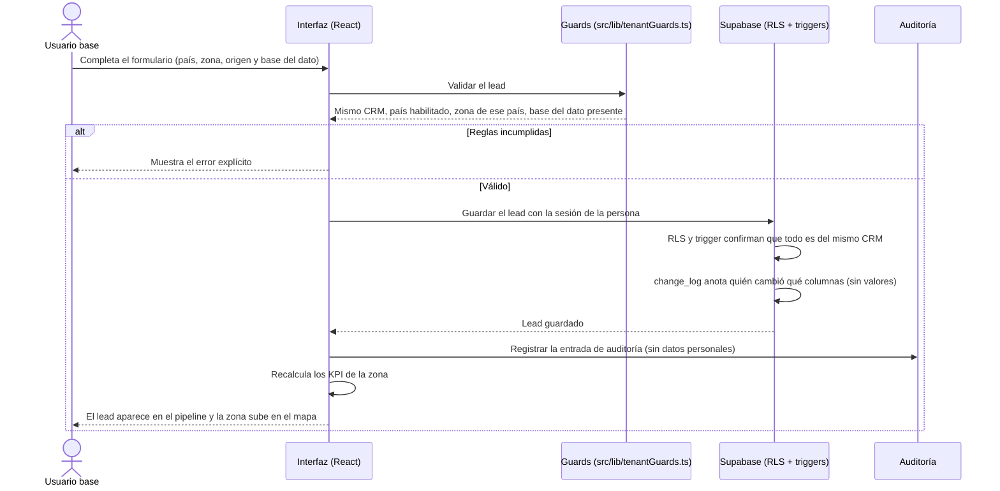
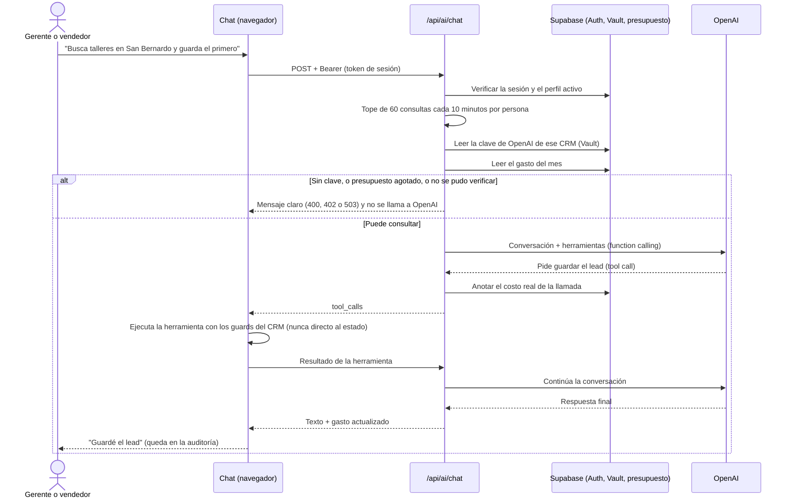
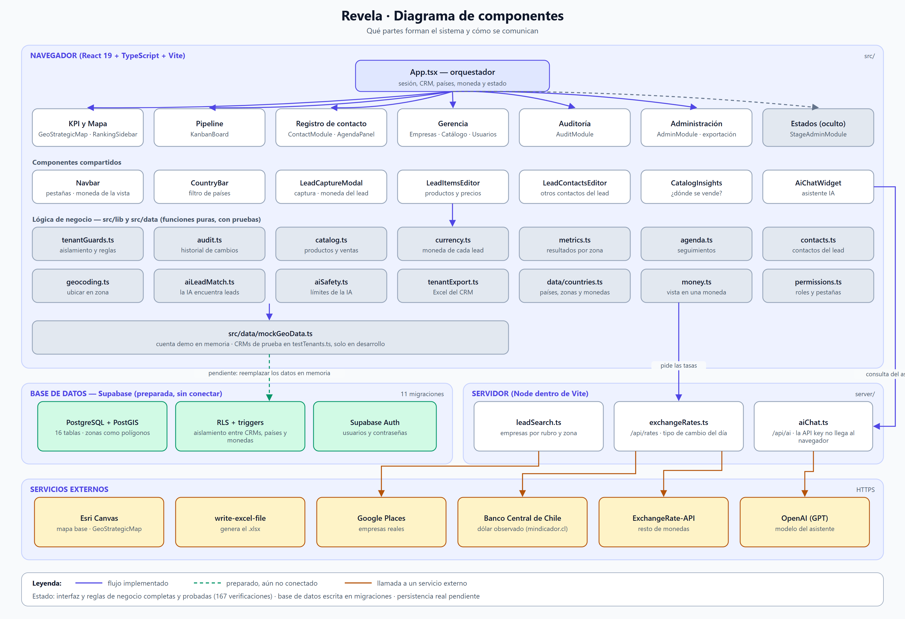

# 9. Diagramas UML

Los cuatro diagramas mínimos del instructivo, escritos en Mermaid (se ven en GitHub y se editan como texto).

## 9.1 Casos de uso

*Versión anterior del diagrama (cuando el producto se llamaba GeoCRM):* [`docs/diagrama-casos-de-uso-geocrm.png`](../../../docs/diagrama-casos-de-uso-geocrm.png).

## 9.2 Diagrama de clases (dominio principal)

Clases del dominio tal como están en `src/types/crm.ts`.

## 9.3 Secuencia de la funcionalidad principal: capturar un lead y verlo en el mapa

## 9.4 Secuencia: el asistente de IA guarda un lead

## 9.5 Diagrama de componentes

Descripción de cada componente en [07-Arquitectura.md](07-Arquitectura.md) §7.2.
