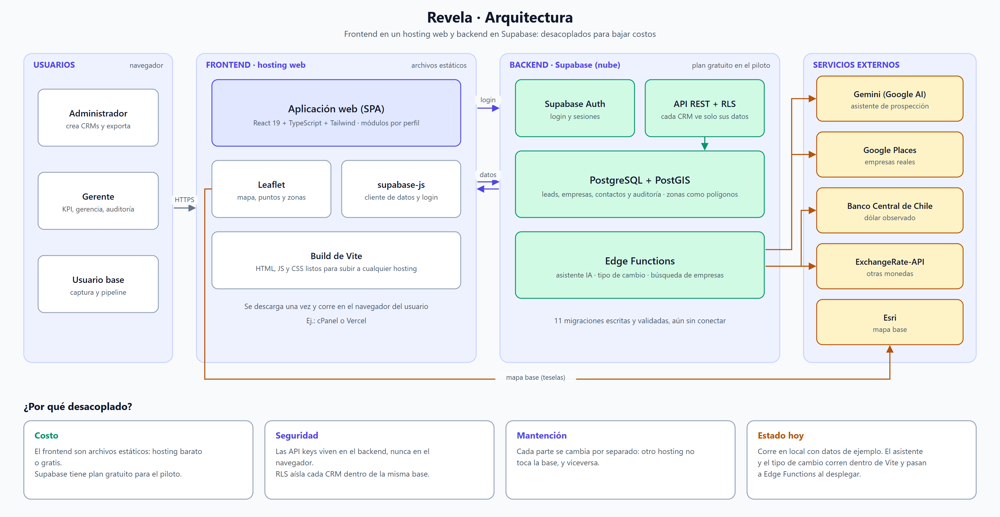
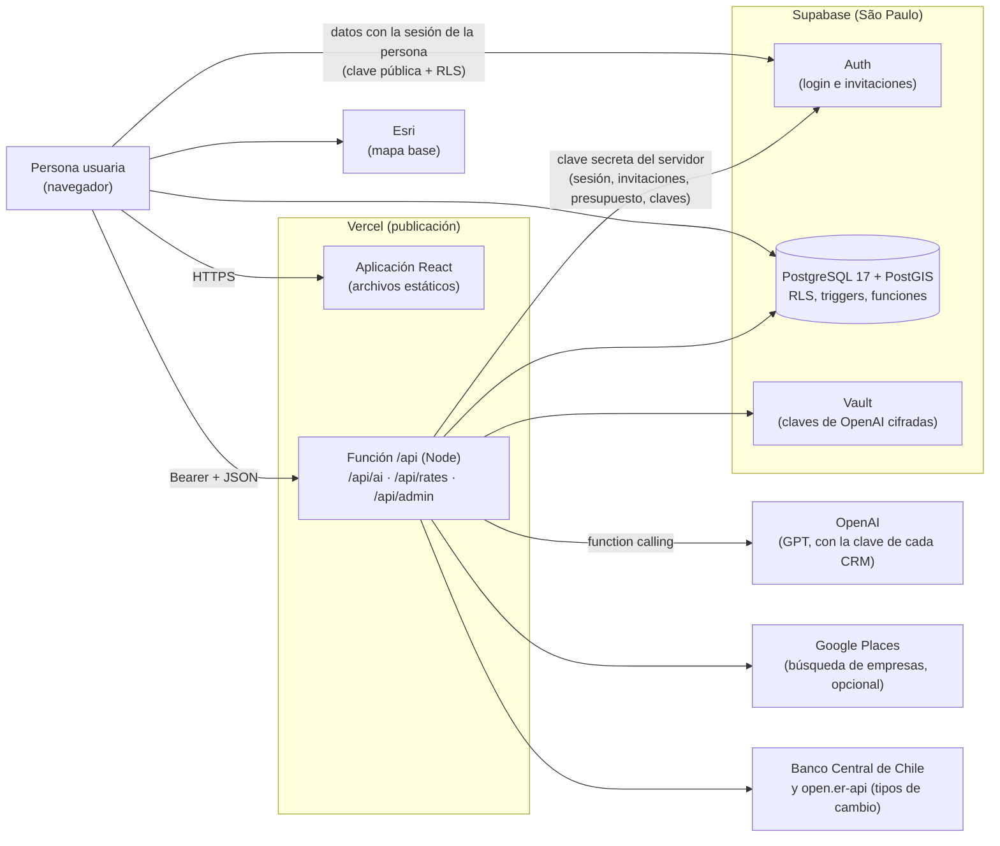

# 7. Arquitectura

## 7.1 Diagrama de arquitectura

La misma arquitectura, en un diagrama editable:

## 7.2 Componentes

| Componente | Responsabilidad | Dónde |
|---|---|---|
| **Interfaz (SPA)** | Módulos: KPI y mapa, Pipeline, Registro de contacto, Gerencia, Auditoría, Administración, asistente. Los que no se ven en la primera pantalla se cargan al abrirlos | `src/components/` |
| **Lógica de negocio pura** | Guards de aislamiento y permisos, monedas, catálogo, métricas, auditoría, privacidad. Sin interfaz, por eso se prueba sola | `src/lib/` |
| **Capa de datos** | Lee y escribe en Supabase por diferencias; en la demo, datos en memoria | `src/lib/db/` |
| **API** | Proxy del asistente de IA, tipos de cambio e invitaciones de usuarios; **la única pieza que usa la clave secreta de Supabase** | `server/` |
| **Base de datos** | Esquema, RLS, triggers, funciones, tareas programadas, zonas oficiales | `supabase/migrations/` |
| **Empaquetado** | Dockerfile, docker-compose, función de Vercel | `Dockerfile`, `server/docker.ts`, `server/vercel.ts` |

## 7.3 Comunicación entre servicios

| Desde → hacia | Protocolo | Autenticación | Qué viaja |
|---|---|---|---|
| Navegador → Supabase | HTTPS (PostgREST / Auth) | Clave pública + sesión de la persona; **la seguridad la impone RLS** | Leads, empresas, catálogo, auditoría |
| Navegador → `/api` | HTTPS, JSON | `Authorization: Bearer <token de sesión>` | Conversación del asistente, consultas de presupuesto y clave, invitaciones |
| `/api` → Supabase | HTTPS | **Clave secreta** (solo en el servidor) | Verificar la sesión, invitar, leer/escribir presupuesto y claves |
| `/api` → OpenAI | HTTPS | Clave de OpenAI **del CRM que consulta** | Ficha mínima del lead; sin correo, teléfono ni monto |
| `/api` → Banco Central / open.er-api | HTTPS | — | Tipos de cambio (solo para mostrar y sumar) |

**Límites de confianza.** El navegador nunca recibe una clave del servidor ni la clave de OpenAI de un CRM (solo sus
últimos 4 caracteres). Publicada, las claves del servidor del asistente solo se usan con una sesión activa de un CRM.

## 7.4 Decisiones de arquitectura

| Decisión | Alternativa descartada | Por qué |
|---|---|---|
| La aplicación habla **directo con Supabase** y la seguridad vive en la base (RLS + triggers) | Un backend propio que intermedie todo | Menos código que mantener y la regla de aislamiento no depende de que cada endpoint la recuerde; se prueba contra la base real |
| **Una sola función `/api`** que reparte por ruta (Build Output API de Vercel) | Una función por ruta | Un único paquete, arranque y pruebas más simples; el mismo manejador corre en Vite, en Vercel y en Docker |
| **Zonas oficiales** (comuna, distrito…) en lugar de coordenadas del lead | Guardar latitud/longitud | Minimización de datos (Ley 21.719): la base **no tiene columnas** para guardar la ubicación exacta |
| Monto **guardado en su moneda**, conversión solo al mostrar | Convertir todo a una moneda base | La conversión cambia cada día; guardar el original evita falsear cifras |
| **Carga por partes** de los módulos pesados (mapa, administración, asistente) | Un solo paquete | La primera pantalla baja unos 190 KB de código propio en vez de más de 1 MB |
| **Clave de OpenAI por CRM**, cifrada en Vault | Una clave de la plataforma | El gasto es de quien usa el asistente y ningún CRM puede gastar la cuenta de otro |
| Gemini → **GPT**, con Gemini apagado por defecto | Mantener dos proveedores activos | Un solo camino que probar, con presupuesto y costo medible |

## 7.5 Modos de ejecución

| Modo | Datos | Quién lo usa |
|---|---|---|
| **Demo** (`VITE_DATA_SOURCE=demo`, o `?demo` en la URL) | Ficticios, en memoria, se pierden al recargar | Visitantes, pruebas automáticas, evaluación |
| **Supabase** (`VITE_DATA_SOURCE=supabase`) | Base real con login, RLS y auditoría | Producción (empresa piloto) |

Detalle de publicación y variables de entorno: [12-Manual-tecnico-y-despliegue.md](12-Manual-tecnico-y-despliegue.md).
