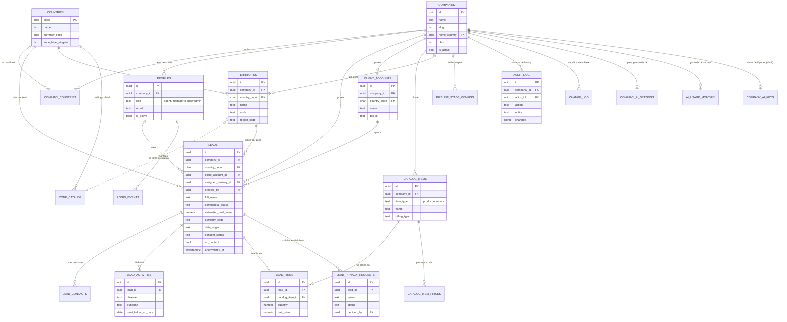

# 8. Modelo de datos

Base relacional: **PostgreSQL 17 con PostGIS** en Supabase. 25 tablas en el esquema `public` (más el almacén de
secretos Vault de Supabase), definidas por **32 migraciones** versionadas en `supabase/migrations/`.
El glosario completo, el orden de las tablas y las reglas están en [`docs/BASE_DE_DATOS.md`](../../../../docs/BASE_DE_DATOS.md).

## 8.1 Diagrama entidad-relación

Relaciones extraídas de las llaves foráneas de las migraciones (se muestran las tablas y columnas principales).

## 8.2 Convenciones y reglas de la base

| Regla | Cómo se cumple |
|---|---|
| **Todo dato pertenece a una empresa** | Toda tabla de datos lleva `company_id` |
| **Las empresas nunca se mezclan** | RLS habilitado en todas las tablas con `company_id` (25 al 30-09-2026; verificado por `npm run test:sql`) y un trigger que valida que las referencias sean del mismo CRM |
| **País coherente** | Un lead y su empresa cliente solo existen en un país habilitado del CRM; su zona es de ese mismo país (trigger) |
| **Sin ubicación exacta** | Las columnas de coordenadas se eliminaron (migraciones 0019 y 0021); el lead se ubica por `assigned_territory_id` |
| **Dinero en su moneda** | `estimated_deal_value` y los precios se guardan en `currency_code`, sin convertir |
| **Auditoría inalterable** | `audit_log` y `change_log` no tienen políticas de `UPDATE` ni `DELETE`; nunca guardan valores personales |
| **Documentada** | Cada tabla y columna tiene `COMMENT ON` (verificado por `test:sql`) |
| **Cambios seguros** | Nunca se edita una migración aplicada; un cambio destructivo se hace en pasos: expandir → copiar → convivir → contraer |

## 8.3 Seguridad de los secretos en la base

La clave de OpenAI de cada empresa **no está en ninguna tabla en claro**: `company_ai_keys` guarda solo un puntero al
secreto en Vault y los últimos 4 caracteres, y las personas con sesión no pueden leerla ni escribirla. Ver
[`docs/SEGURIDAD.md`](../../../../docs/SEGURIDAD.md) §7.
