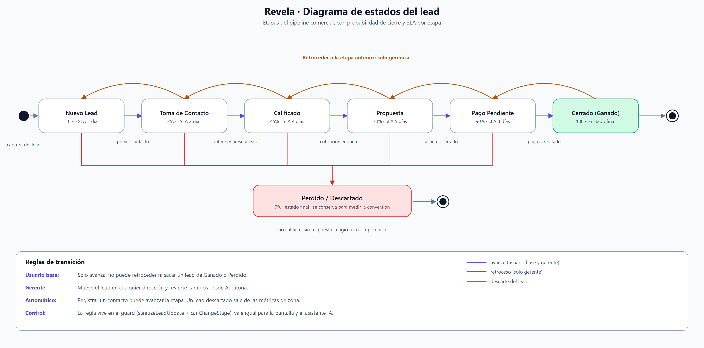
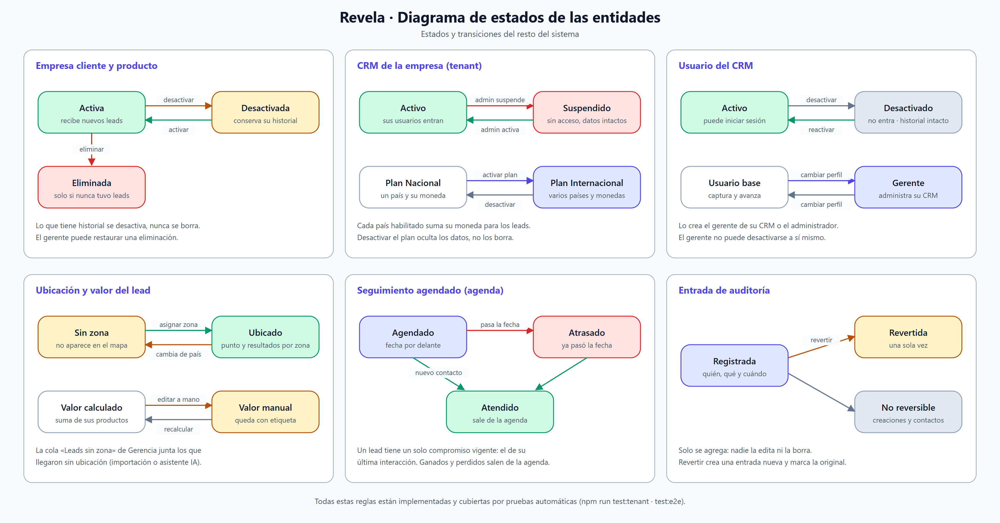


# Revela · Evidencia de avance

**Estudiante:** Yair Costa · **Profesora:** Rocío Contreras · **Sección:** 003D
**Proyecto:** CRM SaaS multi-tenant con inteligencia geográfica (Duoc UC)

Este documento reúne la evidencia pedida: avance del software, diagramas de componentes y de estados, y respaldo del desarrollo. Todo se regenera con dos comandos (`npm run diagramas` y `npm run evidencia`).

---

## 1. Resumen del avance

| Indicador | Valor |
|---|---|
| Código de la aplicación | 11.387 líneas · 38 archivos TypeScript/React |
| Base de datos | 8 migraciones SQL · 1.625 líneas · 14 tablas |
| Servidor del asistente IA | 677 líneas |
| Pruebas automáticas | 1.950 líneas · **125 verificaciones, todas en verde** |
| Documentación técnica | 6 documentos + diagramas |

### Módulos terminados

| Módulo | Estado | Qué incluye |
|---|---|---|
| Autenticación y roles | ✅ | 3 perfiles: usuario base, gerente y administrador de plataforma |
| KPI y Mapa | ✅ | Mapa real con zonas pintadas por rendimiento, ranking por comuna/distrito, 5 KPI y buscador |
| Pipeline (Kanban) | ✅ | 7 etapas, arrastrar y soltar, regla de avance por rol |
| Registro de contacto | ✅ | Bitácora por canal y resultado, con quién se habló, agenda de seguimientos y avance automático de etapa |
| Gerencia | ✅ | Empresas cliente, contactos, catálogo, usuarios del CRM y cola de leads sin zona |
| Estados del pipeline | 🔒 | Construido (probabilidad de cierre y SLA por CRM), oculto del menú durante el piloto |
| Auditoría | ✅ | Historial de cambios con "volver atrás" |
| Administración | ✅ | CRMs, usuarios, plan Internacional y exportación de datos |
| Productos y servicios | ✅ | Catálogo, ítems por lead y análisis de qué se vende y dónde |
| Plan Internacional | ✅ | Chile y Perú, con tipos de zona distintos y moneda por lead (CLP, PEN o US$) |
| Monedas | ✅ | Vista del CRM en CLP o US$ con tipo de cambio del día (Banco Central de Chile) |
| Asistente IA | ✅ | Búsqueda y registro de leads por conversación (en desarrollo local) |
| Portabilidad | ✅ | Exportación completa del CRM a Excel |
| **Persistencia en Supabase** | ⏳ | Migraciones escritas y revisadas; falta ejecutarlas y conectar la app |

**Avance estimado: ≈ 58 %** del software (meta de la entrega: 40 %), ponderado por área:

| Área | Peso | Avance |
|---|---|---|
| Funcionalidad e interfaz | 45 % | ~90 % |
| Base de datos y backend | 35 % | ~25 % (esquema diseñado y validado, sin conectar) |
| Despliegue | 10 % | ~5 % |
| Calidad: pruebas y documentación | 10 % | ~85 % |

Lo principal que falta es conectar la base de datos (hoy los datos viven en memoria y se pierden al recargar) y desplegar.

---

## 2. Arquitectura


Arquitectura desacoplada: el frontend se compila a archivos estáticos y se sube a un hosting web; el backend es Supabase (login, PostgreSQL + PostGIS, RLS y Edge Functions para el asistente IA y el tipo de cambio). Se eligió así para bajar costos y para que las claves de API nunca lleguen al navegador.

Archivos: [`arquitectura-revela.png`](diagramas/arquitectura-revela.png) · [versión vectorial](diagramas/arquitectura-revela.svg)

---

## 2.1 Diagrama de componentes


Muestra las cuatro capas del sistema y cómo se comunican: el navegador (módulos de interfaz, lógica de negocio y datos), el servidor del asistente IA, la base de datos preparada en Supabase y los servicios externos. La línea punteada marca lo que está listo pero aún no conectado.

Archivos: [`componentes-revela.png`](diagramas/componentes-revela.png) · [versión vectorial](diagramas/componentes-revela.svg)

---

## 3. Diagramas de estados

### 3.1 Estados del lead (pipeline comercial)



Las 7 etapas con su probabilidad de cierre y su SLA, las transiciones que las disparan y las reglas por rol: **el usuario base solo avanza leads; retroceder es exclusivo de gerencia**, y la regla se aplica al guardar, no solo en la pantalla.

### 3.2 Estados de las demás entidades



Empresas cliente y productos (activo / desactivado / eliminado), el CRM completo (activo / suspendido y plan Nacional / Internacional), el usuario del CRM (activo / desactivado y su perfil), la ubicación y el valor del lead, los seguimientos de la agenda (agendado / atrasado / atendido) y las entradas del historial de auditoría.

La presentación de esta entrega está en [`Presentacion_Revela_Avance.pptx`](Presentacion_Revela_Avance.pptx).

---

## 4. Evidencia de código

Capturas del código real, cada una con la explicación de por qué es relevante.

| Captura | Qué demuestra |
|---|---|
| [Migración 0007 · Calidad de datos](evidencia/codigo-01-migracion-calidad.png) | Se previene el problema de dividir el nombre en dos columnas **antes** del despliegue, y queda documentado en el archivo que con datos en producción ese cambio debe partirse en dos migraciones |
| [Migración 0004 · Columna nueva sin perder datos](evidencia/codigo-02-columna-con-datos.png) | Al agregar países, los leads existentes quedan en Chile automáticamente gracias al `DEFAULT` |
| [Reglas de negocio](evidencia/codigo-03-reglas-negocio.png) | Funciones puras y probables: aislamiento entre CRMs y la regla de avance del pipeline |
| [Migración 0008 · Auditoría inmutable](evidencia/codigo-04-auditoria-inmutable.png) | La tabla del historial no admite `UPDATE` ni `DELETE`: nadie puede alterar el registro |
| [Usuarios administrados por gerencia](evidencia/codigo-05-usuarios-gerencia.png) | El gerente administra a su equipo, pero el permiso viene acotado desde el código: otro CRM no, administradores no, emails no, autodesactivarse tampoco |

### Decisiones de diseño que previenen problemas futuros

1. **Un solo campo para el nombre** (`full_name`): dividirlo falla con apellidos compuestos.
2. **La moneda se guarda junto al monto**: antes se deducía del país, así que cambiar el país alteraba el historial.
3. **Desactivar en vez de borrar**: todo lo que tiene historial se desactiva.
4. **Procedimiento escrito para cambios peligrosos**: expandir → copiar → convivir → contraer ([`BASE_DE_DATOS.md`](BASE_DE_DATOS.md)).
5. **Revisión automática de migraciones** (`npm run test:sql`): valida sintaxis, RLS, documentación y seguridad de las funciones.

---

## 5. Evidencia de pruebas



Salida real de los cuatro comandos ([texto completo](evidencia/pruebas-automaticas.txt)):

| Comando | Qué valida | Resultado |
|---|---|---|
| `npm run test:tenant` | Reglas de negocio y aislamiento entre CRMs | 43/43 |
| `npm run test:export` | Exportación a Excel (abre el archivo y lo revisa por dentro) | 7/7 |
| `npm run test:sql` | Migraciones: sintaxis, RLS, documentación | 38/38 |
| `npm run test:e2e` | Punta a punta sobre la app real con Chrome | 79/79 |

**Total: 167 verificaciones automáticas.** La más importante: los datos de un CRM nunca se mezclan con los de otro.

---

## 6. Capturas de la aplicación

| Módulo | Captura |
|---|---|
| KPI y Mapa | [app-01-kpi-mapa.png](evidencia/app-01-kpi-mapa.png) |
| Pipeline | [app-02-pipeline.png](evidencia/app-02-pipeline.png) |
| Gerencia · Catálogo | [app-03-gerencia-catalogo.png](evidencia/app-03-gerencia-catalogo.png) |
| Auditoría | [app-04-auditoria.png](evidencia/app-04-auditoria.png) |
| Gerencia · Usuarios | [app-06-gerencia-usuarios.png](evidencia/app-06-gerencia-usuarios.png) |

---

## 7. Guion para la demostración en vivo

Con `npm run dev` corriendo (usuarios de prueba en la pantalla de acceso):

1. **Gerente de Empresa Piloto** (`gerente@piloto.demo`) → *KPI y Mapa*: mostrar el mapa con las zonas pintadas por rendimiento (gris sin cierres, rojo a verde según lo ganado), cambiar el color entre **$ ganado** y **leads cerrados** (el ranking de zonas líderes cambia junto con el mapa), y comparar las tarjetas **Ganado** e **Ingresos estimados**; descartar un lead y mostrar cómo se recalculan las tarjetas, el ranking y los colores del mapa; cambiar a Perú y ver cómo cambian zona y moneda.
2. *Productos y servicios* → buscar un servicio y mostrar **dónde se presta**.
3. **Pipeline**: arrastrar un lead a la siguiente etapa; abrir un lead y mostrar el **cargo del contacto** y sus **otros contactos**.
   Luego, en *Registro de contacto*, mostrar la **agenda** (atrasados, hoy, esta semana y el calendario del mes), **agregar un contacto de la empresa** en el momento y elegir **con quién se habló** antes de guardar la bitácora.
4. **Gerencia → Usuarios**: crear un usuario del CRM y desactivarlo; mostrar que el gerente no puede desactivarse a sí mismo.
5. **Auditoría**: mostrar los cambios recién hechos con autor y hora, y **volver atrás** un cambio.
6. **Cerrar sesión → usuario base**: no tiene las pestañas de gerencia y no puede retroceder leads.
7. **Cerrar sesión → administrador**: ver los CRMs de la plataforma y **exportar uno a Excel**.
8. Cerrar con el terminal: `npm run test:e2e` mostrando las 79 verificaciones en verde.

---

## 8. Cómo regenerar esta evidencia

```bash
npm run diagramas
```

```bash
npm run evidencia
```

El segundo comando ejecuta las pruebas de verdad y captura su salida, así que las cifras siempre corresponden al estado actual del proyecto.
