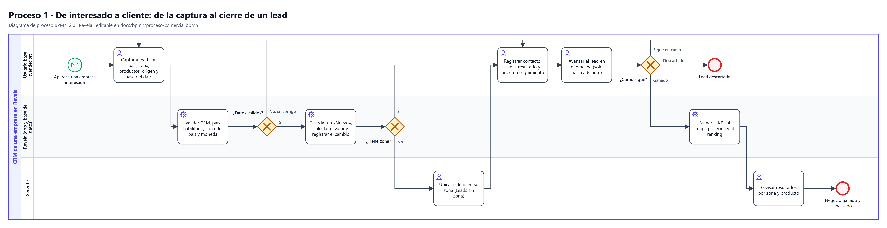
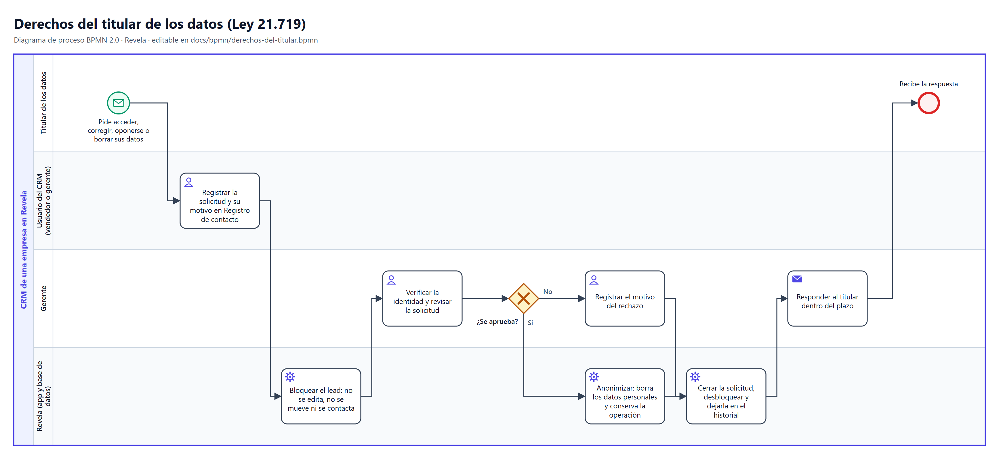
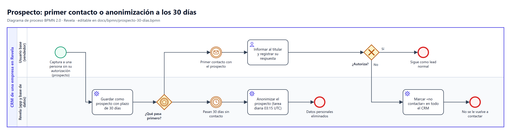
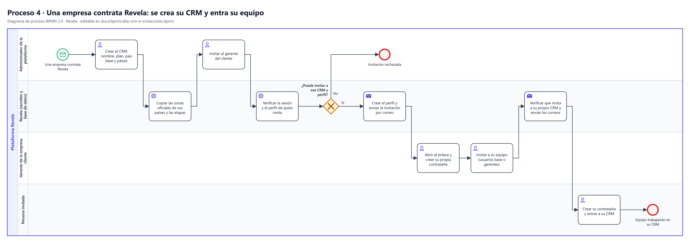
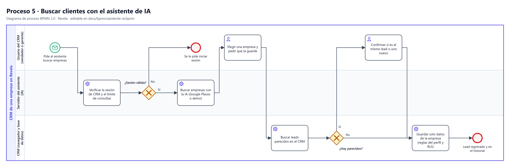

# Procesos de Revela (BPMN 2.0)

Cinco procesos que muestran cómo trabaja cada persona con Revela, de punta a punta, y qué parte de la
app hace cumplir cada paso. Describen lo que la app hace **hoy**: si cambia un flujo, se cambia el
modelo y se vuelven a generar con `npm run bpmn`.

Las imágenes son PNG a 4x (de 7.000 a 9.800 px de ancho), para que no se pixelen al proyectarlas.
`bpmn/diapositiva/` tiene los mismos diagramas sin título, para diapositivas que ya lo llevan.

| Proceso | Imagen | Modelo editable |
|---|---|---|
| 1. De interesado a cliente | [`proceso-comercial.png`](bpmn/proceso-comercial.png) | [`proceso-comercial.bpmn`](bpmn/proceso-comercial.bpmn) |
| 2. Una persona pide ver, corregir o borrar sus datos | [`derechos-del-titular.png`](bpmn/derechos-del-titular.png) | [`derechos-del-titular.bpmn`](bpmn/derechos-del-titular.bpmn) |
| 3. Datos guardados sin permiso: 30 días | [`prospecto-30-dias.png`](bpmn/prospecto-30-dias.png) | [`prospecto-30-dias.bpmn`](bpmn/prospecto-30-dias.bpmn) |
| 4. Una empresa contrata Revela | [`alta-crm-e-invitaciones.png`](bpmn/alta-crm-e-invitaciones.png) | [`alta-crm-e-invitaciones.bpmn`](bpmn/alta-crm-e-invitaciones.bpmn) |
| 5. Buscar clientes con el asistente de IA | [`asistente-ia.png`](bpmn/asistente-ia.png) | [`asistente-ia.bpmn`](bpmn/asistente-ia.bpmn) |

## Cómo leer los diagramas

| Símbolo | Qué es |
|---|---|
| Círculo verde delgado | Evento de inicio. Con sobre: empieza porque llega algo de afuera (un interesado, un contrato, un pedido al asistente o una solicitud del titular) |
| Círculo rojo grueso | Evento de fin |
| Círculo doble con reloj o sobre | Evento de espera: pasa un plazo (temporizador) o llega algo (mensaje) |
| Rectángulo con persona | Tarea de una persona (tarea de usuario) |
| Rectángulo con engranaje | Tarea que hace Revela sola (tarea de servicio) |
| Rectángulo con sobre | Envío de un mensaje o correo (tarea de envío) |
| Rombo con X | Compuerta exclusiva: se toma **uno** de los caminos, según la condición escrita en cada flecha |
| Rombo con pentágono | Compuerta basada en eventos: sigue el camino del **primer** evento que ocurra |
| Carriles | Quién hace cada actividad. El contenedor (pool) es el CRM de una empresa o la plataforma |

## 1. De interesado a cliente: de la captura al cierre



Una empresa aparece interesada; el vendedor la captura como lead, la contacta y la hace avanzar por
el embudo hasta ganarla o descartarla. La gerencia ubica los leads que quedaron sin zona y revisa los
resultados por zona y producto.

| Actividad | Quién | Qué lo hace cumplir |
|---|---|---|
| Capturar lead | Usuario base o gerente | La captura exige origen y base del dato, sin opción por defecto (Ley 21.719). País habilitado del CRM y zona de ese país |
| Validar | Revela | Guards de la app (`src/lib/tenantGuards.ts`) y, en la base, RLS por CRM y triggers de país, zona y moneda (`enforce_lead_country_references`, `set_lead_currency`) |
| Guardar y registrar | Revela | El autor lo firma la base (`created_by`, 0022). El cambio queda en el historial (`audit_log`) y en el registro de la base (`change_log`) |
| Ubicar en su zona | Gerente | Gerencia → Leads sin zona. La zona tiene que ser del país del lead (trigger de la base) |
| Registrar contacto | Usuario base o gerente | La bitácora solo se agrega. No se registra contacto con quien pidió no ser contactado o tiene una solicitud pendiente (`lead_activities_require_contactable`) |
| Avanzar en el pipeline | Usuario base | Solo hacia adelante: `canChangeStage()` en la app y `trg_leads_verify_role_rules` en la base (0022). Retroceder un lead o corregir su monto es de gerencia |
| Sumar al KPI y al mapa | Revela | Cada monto se guarda en su moneda y solo se convierte para mostrar (`useMoney()`). El mapa muestra zonas, nunca la ubicación de una persona |
| Revisar resultados | Gerente | KPI, mapa y ranking son solo de gerencia |

## 2. Una persona pide ver, corregir o borrar sus datos (Ley 21.719)



Una persona cuyos datos están en el CRM pide acceder a ellos, corregirlos, oponerse a su uso o
borrarlos. Cualquier usuario registra la solicitud; desde ese momento el lead queda bloqueado y solo la
gerencia la resuelve.

| Actividad | Quién | Qué lo hace cumplir |
|---|---|---|
| Registrar la solicitud | Cualquier perfil del CRM | `lead_privacy_requests`: la base fija quién la registró, la hora y el estado pendiente |
| Bloquear el lead | Revela | `lead_is_blocked()` en los guards y en los triggers: el lead no se edita, no se mueve de etapa ni se contacta |
| Verificar y revisar | Gerente | Solo gerencia resuelve: `resolve_lead_privacy_request()` verifica el perfil y el CRM |
| Anonimizar | Revela | Borra nombre, correo, teléfono, notas, dirección, las otras personas del lead y lo conversado en la bitácora; conserva zona, etapa, monto y productos. Un lead anonimizado no se vuelve a identificar (`leads_enforce_privacy`) |
| Cerrar la solicitud | Revela | Queda en el historial, que nunca guarda valores personales |
| Responder al titular | Gerente | Fuera de la app, dentro del plazo legal. Para el derecho de acceso y portabilidad, Gerencia descarga el informe del titular en Excel |

## 3. Datos guardados sin permiso: se pregunta en el primer contacto o se borran a los 30 días



Un prospecto es una persona capturada sin su autorización (por ejemplo, desde una fuente pública).
Revela espera lo primero que ocurra: que alguien la contacte, o que pasen 30 días sin contacto.

| Actividad | Quién | Qué lo hace cumplir |
|---|---|---|
| Guardar como prospecto | Revela | Base del dato "sin autorización": queda con plazo de conservación (`PROSPECT_RETENTION_DAYS` = 30) |
| Primer contacto | Usuario base | Al contactarlo se le informa y se registra su respuesta: si autoriza, sigue como lead normal; si no, queda "no contactar" en todo el CRM |
| Pasan 30 días sin contacto | Revela | Tarea diaria de la base (`revela-anonimizar-prospectos`, pg_cron, 03:15 UTC) que llama a `anonymize_expired_prospects(30)` |
| Anonimizar | Revela | Igual que en el proceso 2: se borran los datos personales y se conserva la operación |

## 4. Una empresa contrata Revela: se crea su CRM y entra su equipo



Cuando una empresa contrata Revela, el administrador de la plataforma crea su CRM e invita a su
gerente; el gerente invita a su equipo. Nadie crea la contraseña de otra persona.

| Actividad | Quién | Qué lo hace cumplir |
|---|---|---|
| Crear el CRM | Administrador de la plataforma | Solo el administrador escribe en `companies` (RLS) |
| Copiar zonas y etapas | Revela | Triggers de la base: las zonas oficiales de su país base (345 comunas de Chile) y las etapas por defecto. Las de otro país llegan cuando la gerencia lo activa en Gerencia → Países y divisas (plan Internacional), sin copiar el contorno ([`MULTIPAIS.md`](MULTIPAIS.md)) |
| Invitar | Administrador o gerente | `/api/admin/invite`: el servidor verifica la sesión con Supabase Auth y el perfil (`server/session.ts`); el gerente solo invita a su CRM y nunca administradores (`authorizeInvite()`) |
| Enviar la invitación | Revela | Supabase Auth envía el correo (SMTP de Brevo); el perfil se crea con su CRM y su rol |
| Crear su contraseña | Persona invitada | Solo su dueño la conoce y la cambia; Supabase la guarda con hash (invariante 10) |

Para que la invitación sea **la única** forma de entrar, el registro abierto de Supabase Auth debe
estar desactivado (hallazgo B2 de `docs/SEGURIDAD.md`).

## 5. Buscar clientes con el asistente de IA



El usuario le pide al asistente buscar empresas; elige una y le pide guardarla. Antes de crear un lead,
Revela busca si ya hay uno parecido y pregunta.

| Actividad | Quién | Qué lo hace cumplir |
|---|---|---|
| Verificar la sesión y el límite | Servidor del asistente | Publicado, las claves del servidor solo con sesión de CRM y hasta 60 consultas cada 10 minutos por persona (`server/aiChat.ts`, `server/session.ts`) |
| Buscar empresas | Servidor del asistente | Google Places solo con sesión; sin sesión, datos de demostración |
| Buscar parecidos | CRM | `findDuplicateCandidates()`: con un parecido seguro, el asistente pregunta antes de crear otro |
| Guardar el lead | CRM | Solo datos de la empresa, nunca nombres ni correos de personas (Ley 21.719). Pasa por los mismos guards, reglas del perfil y RLS que una captura a mano, con un tope de escrituras por sesión. El asistente nunca borra nada |

## Cómo cambiar un proceso

Los cinco se generan desde `scripts/generar-bpmn.mjs` (carriles, actividades en columnas y flechas):

```bash
npm run bpmn
```

El script revisa que el modelo tenga sentido (cada actividad con entrada y salida, cada salida de una
compuerta con su condición, sin dos elementos en el mismo lugar) y que el XML sea válido, y deja en
`docs/bpmn/` el `.bpmn`, el `.svg` y el `.png` de cada proceso.

Para ajustar un diagrama a mano, el `.bpmn` se abre en [demo.bpmn.io](https://demo.bpmn.io) (se
arrastra el archivo a la página) o en Camunda Modeler. Ojo: `npm run bpmn` lo vuelve a escribir desde el
script.
